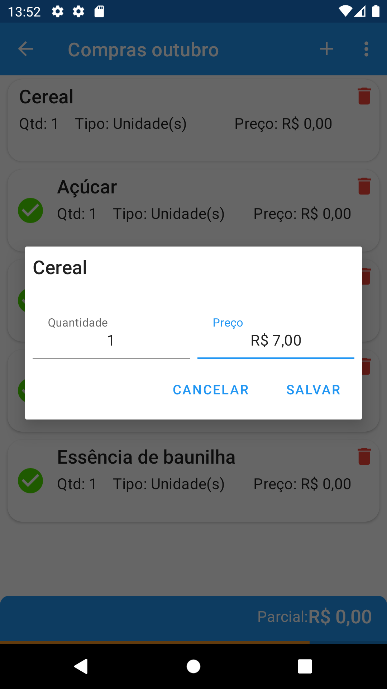

# ShopList-Mvvm

Aplicativo de lista de compras.
Funcionalidades:
* Cadastro, alteração e exclusão de lista de compras
* Cadastro, alteraçãe e exclusão de produtos
* Cadastro, alteração e exclusão de categorias
* Calculo de valores do itens da compra

| Listas de comptas                   | Inserir valor do produto                         | Opçẽs para inserir produto                     |
|------------------------------------|--------------------------------------------------|------------------------------------------------|
|  |  |  |

Ultilizados:
* KOTLIN (linguagem de progração)
* XML (contrução de layouts)
* MVVM (model view viewmodel)
* FRAGMENTS (logica das telas)
* NAVIGATION COMPONENTS/SAFE-ARGS (navegação entre os fragmentos)
* COROUTINES (para executar tarefas fora da thread principal)
* ROOM (salvar os dados localmente)
* SHARED-PREFERENCES (salvar preferências do usuário)
* KOIN (injeção de depêndecias)

Aplicativo publicado na Google Play -> https://play.google.com/store/apps/details?id=br.com.devjmcn.shoplist
